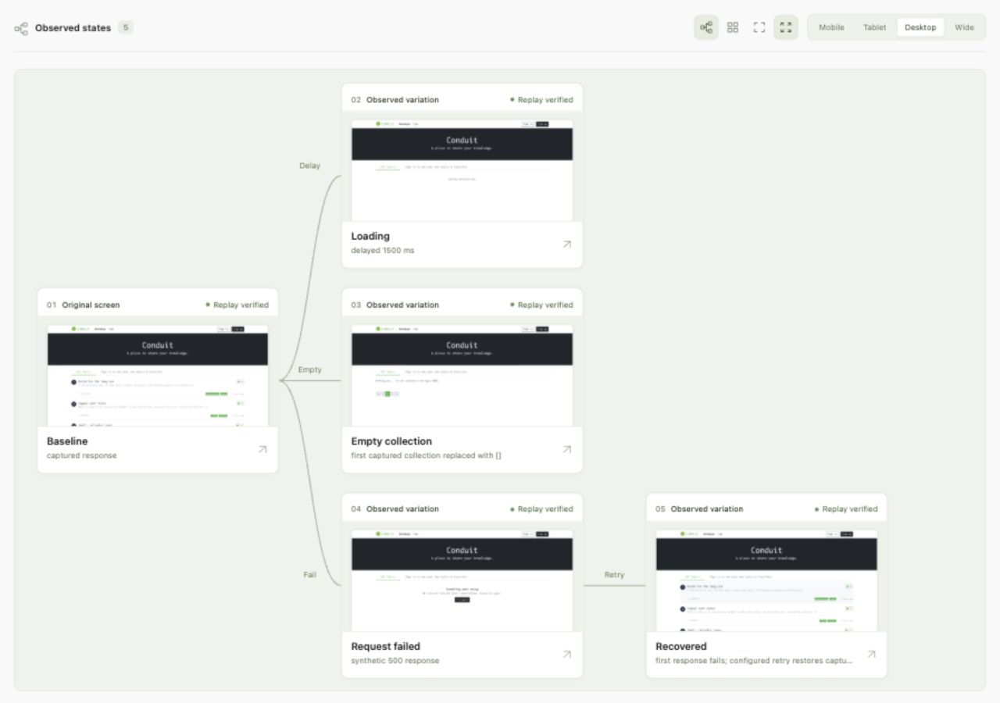

# Screen Explorer

**Give your coding agent more than the happy path.**

A local tool that lets a coding agent see multiple observed UI states together. Capture the original screen, delay a response, empty a collection, inject a failure, and follow a retry into recovery. The agent receives real images and conditions, uses its coding tools to adjust the app, then captures again to check the result.

Local MCP tools · Real screenshots · Recorded replay recipes · MIT licensed



*Real browser captures from the independently maintained Conduit demo target.*

## For coding agents

Connect the [local MCP server](docs/agent-tools.md) to an image-capable coding agent. It exposes `explore_states`, `inspect_states`, `replay_state`, and `list_runs`. The agent receives a labeled multi-state PNG and structured evidence directly from its tool call; it can request individual full-size images when needed.

**Explore → inspect → edit with your agent → explore again.** Screen Explorer supplies observations and replay checks. The agent supplies the reasoning and code edits. This is selected response-state coverage, not a promise to enumerate every screen or automatically fix every issue.

The MCP server uses stdio and opens no listening port. The optional human dashboard remains on **http://localhost:4174**.

## The experience

```text
                       ┌─ Delay ── Loading
Original screen ───────┼─ Empty ── Empty collection
                       └─ Fail ─── Request failed ── Retry ── Recovered
```

**Play exploration** starts with one large captured screen, then reveals its loading, empty, failure, and recovery observations in sequence. Select a state to zoom in and open its recipe directly in a real browser. The presentation is labeled as a recorded exploration; it does not simulate a new scan.

The map displays captured evidence. Branches connect recipes from the same recorded run; a Retry edge requires a recorded click. Unsupported states appear separately, with a reason. The screenshot grid remains available for comparison.

## Start locally

Requires **Node.js 22 or newer** and a web app you control, already running locally or in an authorized staging environment.

From this repository:

```bash
npm ci
npm run browser:install
npm start
```

Open **http://127.0.0.1:4174**. Enter your app URL and select **Explore**. Keep this terminal running; `Ctrl+C` stops the dashboard. `npm start` builds and serves the only dashboard implementation. **The dashboard always uses port 4174. There is no port override or automatic fallback.** If it is occupied, use the existing server or stop it before restarting. Every session must reuse this address; do not create alternate dashboard servers.

On Linux, Playwright may need system libraries: run `npx playwright install --with-deps chromium` in an environment where you can install them. Chrome is used when available at the standard macOS location; otherwise the installed Playwright Chromium is used. No ordinary browser profile is read.

This is an early local tool. The npm package has not been published; installation instructions intentionally use a repository checkout. See the [release checklist](docs/release-checklist.md) before creating a tag or publishing a package.

### Edit with automatic reload

```bash
npm run dev
```

Stop `npm start` before starting development mode. The watcher rebuilds TypeScript, restarts the same server on **4174**, and reloads the browser after a successful build. It does not choose another port. A React migration is not needed for this workflow. Stop active exploration before editing, because rebuilding restarts the local worker.

## Explore an application

1. Enter the app URL. Open the settings icon to set a page budget; start with **1 page** for a repeatable demo.
2. Explore. Progress shows the current page, viewport or state, elapsed time, and whether the engine is capturing or verifying replays. Stop preserves completed evidence.
3. Switch between the **branch map** and **screenshot grid**, then choose a viewport.
4. Select a captured screen. Inspect its condition, capture time, fixture provenance, and replay status. Use the arrow keys to move between states.
5. Select **Open replay** to reconstruct the recorded state in a separate browser.

Automatic experiments run when one eligible JSON collection response is found. When several candidates exist, set an **API response matcher** in settings, such as `/api/items`. An optional CSS retry selector can identify a custom retry control; otherwise the explorer looks for a visible **Retry** or **Try again** button in the failed screen.

### Return to previous work

Click the workspace name in the left sidebar to choose a **recorded workspace**. Workspaces are grouped by app origin, including its port. Use **Evidence** to choose an exact run; **Latest observations** combines the saved evidence for that workspace while retaining each observation's original replay recipe.

Screenshots, fixtures, sessions, and run records are stored under `.screen-explorer/`, which is Git-ignored. Switching workspaces does not delete earlier work.

### CLI

```bash
# Discover pages and capture responsive screenshots
npm run explore -- --target http://localhost:3000 --max-pages 5

# Run controlled experiments against one selected GET response
npm run explore -- \
  --target http://localhost:3000/items \
  --request-url /api/items \
  --retry '[data-testid="retry"]'

# Discover unlinked routes from local source
npm run explore -- --target http://localhost:3000 --source /path/to/app
```

For authenticated controlled runs, complete login yourself in an isolated browser:

```bash
node dist/cli.js login --target https://staging.example.test/login \
  --session .screen-explorer/sessions/staging.json

npm run explore -- --target https://staging.example.test/items \
  --request-url /api/items --session .screen-explorer/sessions/staging.json
```

Session files contain credentials. Keep them local and out of issues, recordings, and commits. The dashboard's page discovery does not currently accept a saved login session; use the controlled CLI workflow for authenticated capture.

## What this proves

A capture proves the browser rendered an observation under a recorded intervention. A verified replay means the visible DOM text matched; it does **not** mean pixel equivalence, backend correctness, or exhaustive state coverage.

- Only captured JSON **GET** responses are transformed. Other request methods besides GET, HEAD, and OPTIONS are blocked during exploration and replay.
- HTTP method is not a complete side-effect guarantee. Use targets whose allowed requests are safe to repeat.
- Source-route discovery is conservative. Dynamic routes need observed example URLs; parameters are never invented.
- Realtime protocols, service workers, server memory, and arbitrary in-memory application state are outside the supported replay model.
- Missing retry controls and responses without a supported collection remain unsupported, with visible reasons.
- Page discovery has a configurable page budget. Unlimited crawling can encounter endless query-string navigation.

## Development

```bash
npm ci
npm run format
npm run verify
npm start
```

The project uses TypeScript, Node's HTTP server, Playwright, and a small browser UI without a frontend framework. There is one dashboard entry point in `src/dashboard/view.ts`, one interaction module, one stylesheet, and shared SVG icons. `dist/` is generated; edit `src/` and rebuild.

```text
src/
  cli.ts                    Local commands
  dashboard/                UI and HTTP API
  domain/                   Evidence contracts, library, fixture transforms
  infrastructure/           Browser capture, discovery, replay, storage
  demo-verify.ts            Repeated real-browser demo gate
```

CI checks TypeScript, tests, and package contents on Linux, macOS, and Windows with Node 22 and 24. CI configuration is not a claim that those remote runs have already passed. Browser demo verification is a separate integration gate against a real target:

```bash
npm run demo:verify -- .screen-explorer/runs/<state-run-id>
```

This requires all five states and four viewport sizes, then verifies each combination three times. The report stays inside the private run directory.

See [contribution guidelines](CONTRIBUTING.md), [architecture](docs/architecture.md), [demo setup](docs/demo-target.md), and [demo readiness](docs/demo-readiness.md). Report vulnerabilities using [the security policy](SECURITY.md).

## Contributing and release status

Small fixes with reproducible browser evidence are welcome. Keep independently authored target applications outside this repository. Do not attach session files, captured API bodies, or private screenshots to public issues. Report vulnerabilities through the [private security advisory form](https://github.com/solhosty/ui-state/security/advisories/new).

The implementation is prepared for open-source review, not a universal browser-testing platform. The current `0.1.0` release candidate still requires successful hosted CI, a sanitized demo recording, and a final package review before a public tag or package publication. Nothing is automatically published by the development commands.

[MIT License](LICENSE) · Copyright 2026 Hunter
